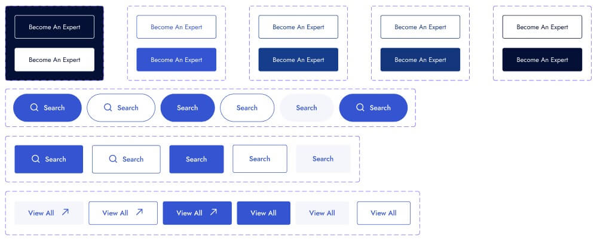

## Getting Started

```bash
npm run dev
# or
yarn dev
# or
pnpm dev
# or
bun dev
```

### API Button Props

`Button Props` | The component inherits the props of the regular HTML button element.
`Link Props` | The component inherits the props of the Next.js Link component and requires a href prop

| Attribute `props` | Type                                                                  | Description                           | Default                       |
| ----------------- | --------------------------------------------------------------------- | ------------------------------------- | ----------------------------- |
| `href`            | `string`                                                              | Return next.js `Link` component       | "Return button accept `href`" |
| `children`        | `ReactNode`                                                           | The content to display in the button. | -                             |
| `color`           | `default` \| `darkest-gray` \| `blue` \| `dark-blue` \| `darker-blue` | The button color theme.               | `default`                     |
| `variant`         | `bordered`                                                            | The button appearance style.          | `solid outline`               |
| `size`            | `sm`\| `md` \| `lg`                                                   | The button size.                      | `md`                          |
| `radius`          | `none`\| `sm` \| `md` \|`lg`\|`full`                                  | The button border radius.             | `none`                        |
| `fontWeight`      | `normal`\| `medium` \| `semibold`                                     | The button font weight.               | `normal`                      |
| `starticon`       | `ReactNode`                                                           | The button start content.             | -                             |
| `endicon`         | `ReactNode`                                                           | The button end content.               | -                             |


