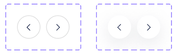
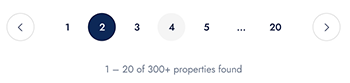
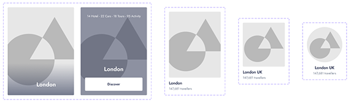
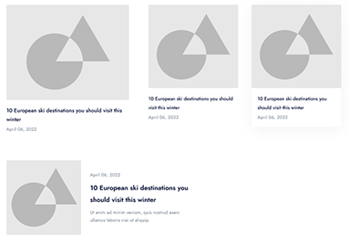

# GoOutFilter-Travel-and-Tour-Agency-TypeScript-Next.js-Template

```bash
git clone https://github.com/prantomollick/GoOutFilter-Travel-and-Tour-Agency-Next.js-Template.git
cd GoOutFilter-Travel-and-Tour-Agency-Next.js-Template
npm i
```

## Getting Started

```bash
npm run dev
# or
yarn dev
# or
pnpm dev
# or
bun dev
```

## Components

### Button Component Api description:

All reuseable component inside the `component` directory. Root directory access to these component like that `@/component/ui/button/<button.tsx>`;
`Button Props` | The component inherits the props of the regular HTML button element.
`Link Props` | The component inherits the props of the Next.js Link component and requires a href prop

| Attribute `props` | Type                                                                  | Description                           | Default                       |
| ----------------- | --------------------------------------------------------------------- | ------------------------------------- | ----------------------------- |
| `href`            | `string`                                                              | Return next.js `Link` component       | "Return button accept `href`" |
| `children`        | `ReactNode`                                                           | The content to display in the button. | -                             |
| `color`           | `default` \| `darkest-gray` \| `blue` \| `dark-blue` \| `darker-blue` | The button color theme.               | `default`                     |
| `variant`         | `bordered`                                                            | The button appearance style.          | `solid outline`               |
| `size`            | `sm`\| `md` \| `lg`                                                   | The button size.                      | `md`                          |
| `radius`          | `none`\| `sm` \| `md` \|`lg`\|`full`                                  | The button border radius.             | `none`                        |
| `fontWeight`      | `normal`\| `medium` \| `semibold`                                     | The button font weight.               | `normal`                      |
| `starticon`       | `ReactNode`                                                           | The button start content.             | -                             |
| `endicon`         | `ReactNode`                                                           | The button end content.               | -                             |


### Arrow Button Component Api description:

All reuseable component inside the `component` directory. Root directory access to these component like that `@/component/ui/arrow-btn/<arrow-btn.tsx>`;
The arrow button default render as a `button` html component. and all props and attributes, events elegible for button component. Inherits all `Button Props`, but does not require a `href`.
Acception, if you write `href` props inside the `<ArrowBtn href="/" />` component, it will render as an anchor tag with an emoji icon.
`<ArrowBtn />` component all props reference:

| Attribute `props` | Type                               | Description                                                                | Default              |
| ----------------- | ---------------------------------- | -------------------------------------------------------------------------- | -------------------- |
| `href`            | `string`                           | Return next.js `Link` component and render html a element into the webpage | -                    |
| `direction`       | `up`\| `down` \| `left` \| `right` | Arrow button arrow icon direction                                          | `Nutral smile emoji` |
| `variant`         | `bordered`                         | The button appearance style                                                | -                    |
| `color`           | `default`                          | The button color theme default is white with shadow                        | `default`            |
| `size`            | `sm`\| `md` \| `lg` \| `xl`        | The button size.                                                           | `md`                 |



### Pagination Component with usePagination custom hook:

[Details about the pagination hook](https://github.com/prantomollick/GoOutFilter-Travel-and-Tour-Agency-Next.js-Template/blob/main/src/components/pagination/redme.md#overview)
It is client component, when you use this component must use `use client` on top of the file. Here is code below how can you use Pagination component into your app;

```javascript
"use client";
import Pagination from "@/components/pagination/pagination";
import { useState } from "react";

export default function Home() {
  const [currentPage, setCurrentPage] = useState(1);

  return (
    <>
      <Pagination
        currentPage={currentPage}
        totalCount={200}
        pageSize={10}
        onPageChange={(page) => {
          setCurrentPage(page);
        }}
      />
    </>
  );
}
```



### CardDestination Component

`card-destination` module directory into the components file. Develope the `CardDestination` component for showing blog posts in a card format.
Card destination is for destination photo viewing card. Which key element is image. Take your great tour photo and put it into this component.

| Attribute `props` | Type                      | Description                                    | Default    |
| ----------------- | ------------------------- | ---------------------------------------------- | ---------- |
| `imgLink`         | `string`                  | Image link is required for this component      | -          |
| `title`           | `string`                  | Card Title is required for this component      | -          |
| `size`            | `xs`\|`sm`\| `md` \| `lg` | Different variant card size                    | `lg`       |
| `extraSmallText`  | `string`                  | Extra card content below this card little text | `optional` |



### CardBlog Component

`card-blog` module directroy into the components file. Develope the `CardBlog` component for showing blog posts in a card format. This component receives as props an object of type BlogPost interface
TypeScript.

| Attribute `props` | Type                                      | Description                                    | Default    |
| ----------------- | ----------------------------------------- | ---------------------------------------------- | ---------- |
| `imgLink`         | `string`                                  | Image link is required for this component      | -          |
| `title`           | `string`                                  | Card Title is required for this component      | -          |
| `size`            | `sm`\| `md` \| `lg`                       | Different variant card size                    | `lg`       |
| `shadow`          | `none`\| `shadow-subtle` \| `shadow-soft` | Different variant card shadow                  | `none`     |
| `date`            | `Date`                                    | Take javascript returns date object            | `required` |
| `extraSmallText`  | `string`                                  | Extra card content below this card little text | `optional` |



### Modal component:

`src/components/modal/modal.tsx`

```javascript
"use client";
import styles from "./modal.module.scss";

import classNames from "classnames";
import { ReactNode } from "react";
import { createPortal } from "react-dom";
import { GoX } from "react-icons/go";

interface ModalProps {
  children: ReactNode;
  title?: string;
  width?: number;
  height?: number;
  isOpen: boolean;
  onClose: () => void;
}

function Modal({
  children,
  title,
  width = 1070,
  height,
  isOpen,
  onClose
}: ModalProps) {
  if (!isOpen) return null;

  const renderModal = (
    <div className={styles.modal__overlay} onClick={onClose}>
      <div
        className={styles.modal__container}
        style={{ width, height }}
        onClick={(e) => e.stopPropagation()}
      >
        <div className={styles.modal__header}>
          <h2 className={styles.modal__title}>{title}</h2>

          <button
            onClick={onClose}
            className={classNames(styles["modal__close--btn"], "btn")}
          >
            <GoX size={20} />
          </button>
        </div>
        <div className={styles.modal__body}>{children}</div>
      </div>
    </div>
  );

  return createPortal(renderModal, document.body);
}

export default Modal;
```

#### Modal Props

| Prop       | Type                    | Default Value | Description                                          |
| ---------- | ----------------------- | ------------- | ---------------------------------------------------- |
| `children` | `ReactNode`             | -             | Content to be displayed inside the modal. Modal Body |
| `title`    | `string`                | -             | Title of the modal.                                  |
| `width`    | `number`                | 1070          | Width of the modal.                                  |
| `height`   | `number`                | -             | Height of the modal.                                 |
| `isOpen`   | `boolean` (required)    | -             | Determines if the modal should be displayed.         |
| `onClose`  | `() => void` (required) | -             | Callback function to handle the modal close event.   |

#### Styling Guide for Modal Component

The `Modal` component comes with default styling using SCSS. However, you can customize the appearance of the modal to better suit your application's design. The styling is organized in the `modal.module.scss` file.

### NavigationTabCard Component

The `NavigationTabCard` component is a reusable React component designed for creating navigation cards with an image, title, and a button. It is implemented using TypeScript and SCSS and leverages the Next.js framework.

#### Installation

To use the `NavigationTabCard` component in your project, follow these steps:

1. Make sure you have Next.js installed in your project.
2. Copy the `navigation-tab-card.module.scss` file into your project's styles directory.
3. Import the `NavigationTabCard` component in your desired file.

```javascript
import NavigationTabCard from "path-to-navigation-tab-card";
```

#### Props and Usage

The `NavigationTabCard` component takes the following props:
| Prop | Type | Required | Description |
|------------|--------------------------------|----------|------------------------------------------------------------------------------------------------------|
| `imgLink` | string | Yes | The URL or path to the image that will be displayed on the card. |
| `imgSize` | { width: number, height: number } | No | An object with `width` and `height` properties specifying the dimensions of the image. If not provided, default values (width: 280, height: 300) will be used. |
| `title` | string | Yes | The title of the navigation card. |
| `btnText` | string | Yes | The text to be displayed on the button. |
